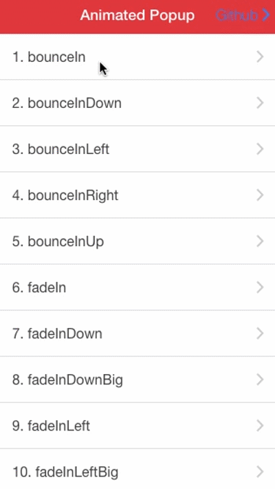

### Personal favorite ``bounceIn``

I use that in my app. http://friendsapp.parseapp.com/

### DEMO (codepen)



http://codepen.io/kevincobain2000/pen/RWjoNR

## How TO

### Add Animate css

https://daneden.github.io/animate.css/

```
<link href="//cdnjs.cloudflare.com/ajax/libs/animate.css/3.4.0/animate.min.css" rel="stylesheet">
```


### How To


#### HTML

```
<button type="" class="button" ng-click="showConfirm('bounceIn')">showConfirm bounceIn</button>
```

#### In your controller

```
.controller('AppCtrl', function($scope, $timeout, $ionicPopup) {
   // A confirm dialog
   $scope.showConfirm = function(animation) {

    // Add animate css class to out popup container
     $timeout(function(){
      var popupElements = document.getElementsByClassName("popup-container")
      if (popupElements.length) {
        $scope.popupElement = angular.element(popupElements[0]);
          $scope.popupElement.addClass('animated')
          $scope.popupElement.addClass(animation)
      };
    }, 1)
    // Done

    // A confirm dialog TAKEN FROM http://ionicframework.com/docs/api/service/$ionicPopup/
     var confirmPopup = $ionicPopup.confirm({
       title: 'Consume Ice Cream',
       template: 'Are you sure you want to eat this ice cream?',
     });
     confirmPopup.then(function(res) {
       if(res) {
         console.log('You are sure');
       } else {
         console.log('You are not sure');
       }
     });
   };
})
```


#### List of Animations

```
bounceIn
bounceInDown
bounceInLeft
bounceInRight
bounceInUp
fadeIn
fadeInDown
fadeInDownBig
fadeInLeft
fadeInLeftBig
fadeInRight
fadeInRightBig
fadeInUp
fadeInUpBig
flipInX
flipInY
lightSpeedIn
rotateIn
rotateInDownLeft
rotateInDownRight
rotateInUpLeft
rotateInUpRight
slideInUp
slideInDown
slideInLeft
slideInRight
zoomIn
zoomInDown
zoomInLeft
zoomInRight
zoomInUp
rollIn
```

#### Also See

https://github.com/kevincobain2000/ionic-animated-modal